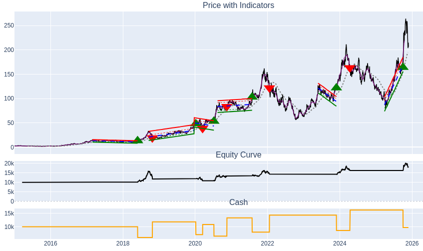

# Sociocratic Trading Cooperative  
A community-driven, non-profit algorithmic trading project.

## Vision

This project aims to create a safe, transparent, low-cost trading system for people with small investments. Most small investors lose money to scams, hype, or high-fee platforms. This project aims to offer the opposite:

- A well-tested, data-driven system  
- Built for real people, not institutions  
- Accessible and low-cost  
- Focused on long-term safety rather than fast trading temptations  

Each user will be able to choose their own assets (stocks, ETFs, or crypto).  
Ethics remain personal. The system is asset-neutral.

---

## Project Status


Below is an example output from the backtesting engine:


*(Example backtest on AMD using the current prototype strategy.  
Green arrows indicate buy signals and red arrows indicate sell signals.  
Flat equity periods mean the system will eventually be searching for other opportunities.)*

This repository currently contains:

- A complete backtesting engine  
- A working strategy prototype  
- Cross-testing tools for multiple assets  
- Early-stage profitability across several instruments  

Repository: https://github.com/munkefrugt/trading_bot

---

## How to Contribute

This project is built using sociocracy. Anyone joining must be willing to collaborate using consent-based decision-making, clear domains, and transparent communication.

You only need one of the skills below to be useful.

### Code Review and Refactoring

- Improve structure  
- Simplify architecture  
- Increase readability  

### Math and Statistics

- Analyze performance metrics  
- Spot biases  
- Strengthen statistical foundations  

### Experienced Traders

- Knowledge of breakouts  
- Knowledge of Bollinger Bands  
- Knowledge of Ichimoku Cloud  
- Knowledge of trend-following logic  

### Organizational and Facilitation Roles

- Help build sociocratic structures  
- Organize workflows  
- Facilitate meetings or circles  
- Work on documentation and processes  

### Cooperative Designers

- Governance model design  
- Circle and domain definition  
- Onboarding structure  
- Long-term organizational design  

---

## Long-Term Goal

Once stable and validated, the system will become a:

- Cooperative  
- Non-profit  
- Community-owned trading service  

Any future surplus will support:

- Tools that help spread sociocracy  
- Complementary currency projects  
- Community-focused software  
- Underfunded scientific projects  
- Other sociocratically chosen initiatives  

---

## Installation

```
git clone https://github.com/munkefrugt/trading_bot
cd trading_bot
pip install -r requirements.txt
```

---

### Run

```
python main.py
```

---

### Try it with other symbols

Go to the file `get_data.py` in the same folder as `main.py`.

Change the first line in the function `fetch_btc_data`:

```
symbol = "YOUR_SYMBOL_HERE"
```

Examples:

```
symbol = "BTC-USD"
symbol = "AMD"
```

---

## Contact and Join

If you would like to contribute or follow the project, reach out:

Martin Moltke Wozniak  
BA in Physics and Computer Science  
Email: munkefrugt@gmail.com  
Copenhagen, Denmark  

If you are not ready to join yet, you are welcome to write anyway and tell me what would need to be in place for you to consider joining later.

---

## Support

If this project resonates with you, giving the repository a star helps others discover it.

---

## Acknowledgements

Thanks to everyone interested in cooperative, transparent, community-owned technology. Together we can build tools that genuinely help people.
